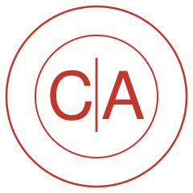

<p align="center">
  
</p>

<h1 align="center">Cumhuriyet Avukatları — PDF Araçları</h1>

<p align="center">
  Avukatlar için <strong>%100 tarayıcıda çalışan</strong>, ücretsiz ve açık kaynak PDF araç seti.<br>
  Dosyalarınız hiçbir sunucuya yüklenmez.
</p>

<p align="center">
  <strong>Canlı site:</strong> <a href="https://ersancetin.github.io/cumhuriyet-avukatlari/">ersancetin.github.io/cumhuriyet-avukatlari</a>
</p>

---

## Neden bu proje?

Avukatlık Kanunu m.36 uyarınca sır saklama yükümlülüğü tavizsizdir. Müvekkil bilgisi içeren dilekçe,
delil ve belgelerin, kim tarafından işletildiği belli olmayan çevrimiçi PDF sitelerine yüklenmesi hem
meslek etiği hem de 6698 sayılı KVKK bakımından risk oluşturur.

Bu proje, bilinen çevrimiçi PDF araçlarının **tamamen istemci taraflı (client-side)** bir alternatifidir:
tüm işlemler kullanıcının kendi tarayıcısında, cihazın belleğinde gerçekleşir. Sitenin dosya kabul
edebileceği bir sunucusu dahi yoktur.

## Araçlar

| Araç | Açıklama |
|---|---|
| JPG → PDF | JPG/PNG/WebP görsellerini sıralayarak tek PDF'te toplar |
| TIFF → PDF | Tek ve çok sayfalı TIFF/TIF taramaları PDF'e çevirir |
| PDF Birleştir | Birden fazla PDF'i istenen sırada birleştirir |
| PDF Ayır | Sayfa aralığı çıkarır veya her sayfayı ayrı PDF yapar (ZIP) |
| PDF Sıkıştır | UYAP/e-posta sınırları için dosya boyutunu küçültür |
| PDF → JPG / PNG | Sayfaları 72/150/300 DPI görsellere dönüştürür |
| PDF Döndür | Sayfaları 90°/180°/270° kalıcı döndürür |
| Sayfa Sil | Belirtilen sayfaları belgeden kaldırır |
| Filigran Ekle | "GİZLİDİR", "SURET" gibi metinleri tüm sayfalara işler |
| Sayfa Numarası | Otomatik sayfa numarası ekler |

## Veri güvenliği ve KVKK

- Dosyalar **internete gönderilmez**; işlem tarayıcının belleğinde yapılır ve sekme kapanınca iz kalmaz.
- Site **çerez, üyelik, izleme ve analitik içermez**; KVKK anlamında kişisel veri toplamaz, işlemez, aktarmaz.
- İddia doğrulanabilir: geliştirici araçlarının "Ağ" sekmesinden hiçbir dosyanın dışarı gitmediği görülebilir.
- Ayrıntılar: [Gizlilik & KVKK Bildirimi](gizlilik.html)

## Teknik yapı

Derleme adımı olmayan statik bir sitedir (HTML + CSS + vanilla JS). Kullanılan açık kaynak kütüphaneler
`assets/vendor/` altında yerel olarak barındırılır; çalışma anında hiçbir CDN'e bağlanılmaz:

- [pdf-lib](https://github.com/Hopding/pdf-lib) — PDF oluşturma/düzenleme (MIT)
- [PDF.js](https://github.com/mozilla/pdf.js) — PDF görüntüleme/görsele dönüştürme (Apache-2.0)
- [UTIF.js](https://github.com/photopea/UTIF.js) — TIFF çözme (MIT)
- [JSZip](https://github.com/Stuk/jszip) — ZIP arşivleme (MIT)
- [DejaVu Sans](https://dejavu-fonts.github.io/) — filigranlarda Türkçe karakter desteği

### Yerelde çalıştırma

```bash
python3 -m http.server 8000
# http://localhost:8000
```

### Yayın

Depo, `.github/workflows/deploy.yml` üzerinden GitHub Pages'e otomatik yayınlanır.

## Katkı

Hata bildirimi ve katkılarınız için [Issues](https://github.com/ersancetin/cumhuriyet-avukatlari/issues)
sayfasını kullanabilirsiniz. Dileyen meslektaşlarımız projeyi kendi barosu veya bürosu için çoğaltabilir.

## Lisans

[MIT](LICENSE) — Cumhuriyet Avukatları tarafından meslektaş dayanışması için geliştirilmiştir.
